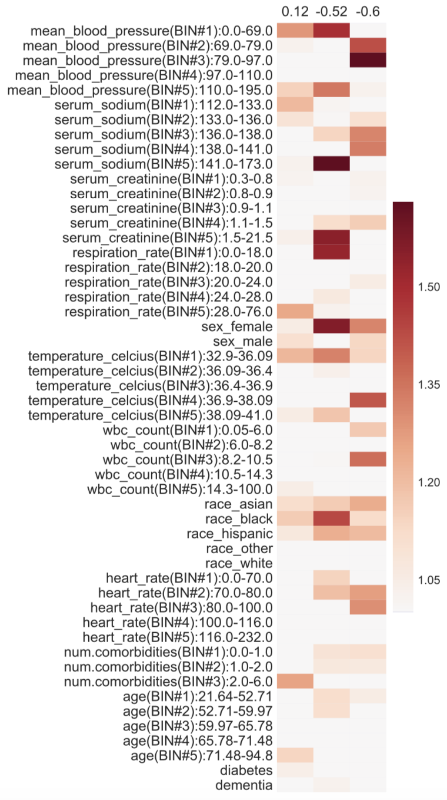

# Neural Topic Models with Survival Supervision

A neural network approach that jointly learns a survival model, which predicts time-to-event outcomes, and a topic model, which captures how features relate. We tested this approach on seven healthcare datasets.  

## Table of Contents

* [Models](#models)
  * [Hyperparameter Grid](#hyperparameter-grid)
  * [Selecting the Number of Topics](#selecting-the-number-of-topics)
* [Datasets](#datasets)
* [Topics Learned](#topics-learned-model-outputs)
* [Running Experiments](#running-experiments)
  * [Requirements](#required-packages)
  * [Tutorial](#running-experiments-1)
    * [Demo](#demo-survscholar--metabric)
  * [Visualizing Topics Learned](#generating-heatmaps)
  
## Models

Besides our proposed approach, the survival models listed below are used to establish baselines. Each model is linked to its implementation script. These models may take in data in different formats, as documented in the **Data Format** column. The next section explains data format in detail. 

| Model  | Descriptions | Type | Data Format |
| ------ | ------------ | ---- | ----------- |
| [coxph](survival_baselines/CoxPHModel.py)  | Cox regression with lasso regularization | baseline | cox |
| [coxph_pca](survival_baselines/survival_baselines/CoxPHModel.py) | Lasso-regularized cox preceded by PCA | baseline | original |
| [coxph_unreg](survival_baselines/CoxPHModel.py) | Unregualrized cox regression        | baseline | cox |
| [knnkm](survival_baselines/KNNKaplanMeier.py) | KNN-Kaplan-Meier | baseline | original |
| [knnkm_pca](survival_baselines/KNNKaplanMeier.py) | KNN-Kaplan-Meier preceded by PCA | baseline | original |
| [weibull](survival_baselines/WeibullRegressionModel.py) | Weibull regression | baseline | original |
| [weibull_pca](survival_baselines/WeibullRegressionModel.py) | Weibull regression preceded by PCA | baseline | original |
| [rsf](survival_baselines/RandomSurvivalForest.py) | Survival random forest | baseline | original |
| [deepsurv](survival_baselines/DeepSurv.py) | [DeepSurv](https://github.com/havakv/pycox) | baseline | original |
| [deephit](survival_baselines/DeepHit.py) | [DeepHit](https://github.com/havakv/pycox) | baseline | original |
| [lda_cox](survival_topics/LDACox.py) | Cox regression preceded by LDA | topic | discretize |
| [survscholar_linear](survival_topics/SurvScholarModel.py) | Supervised cox regression preceded by [scholar](https://github.com/dallascard/scholar) | topic | discretize |
| [survscholar_nonlinear](survival_topics/SurvScholarModel.py) | Supervised cox regression preceded by scholar, with nonlinear survival layers | topic | discretize |

### Hyperparameter Grid

We performed random hyperparameter search for all models within each of the search spaces specified in [this table](hyperparameters.png); note that for different datasets, our search spaces vary. For each model, we selected the set of hyperparameters that achieved the best cross-validation time-dependent concordance index, as described in the paper.

### Selecting the Number of Topics

In the paper, we described how we selected the number of topics for each dataset by looking at training cross-validation c-index vs number of topics. Refer to [this figure](select_number_of_topics.png) for a plot of all datasets' training cross-validation c-index vs number of topics.

## Datasets

A list of supported datasets, data preprocessing scripts and details are documented on [this page](dataset/).

## Topics Learned (Model Outputs)

Topics learned by our proposed approach are either visualized in heatmaps or listed as top words per topic by convention. Below are examples on the **SUPPORT-3** dataset. For all other datasets' outputs, go to [here](topics_learned/). Refer to the paper for how these outputs should be interpreted.




## Running Experiments

Follow this section to replicate results in the paper. 

### Required Packages

Package requirements could be found [here](requirements.txt). You could set up the required environment in the command line: 

```
>>> python3 -m venv env_npsurvival
>>> source env_npsurvival/bin/activate
>>> pip3 install -r Survival2019/requirements.txt
```

### Running Experiments

To run an experiment:

1. ```git clone``` this repo to a local directory.
2. Make sure all required packages are installed (see section **Required packages**).
3. ```cd``` into the repo directory, replace the ```dataset/``` folder with one that actually contains the data. Data is omitted in this repo because some of our datasets require applying for access.
4. Make sure hyperparameter search boxes are configured in a ```json``` file under ```configurations/```. You could find plenty of examples [here](configurations/). 
5. Modify experiment settings in the bash script ```run_experiments.sh```, and type ```sh run_experiments.sh``` in the command line.
6. This will kick off the experiment. Be sure to name experiments properly using the ```experiment_id``` option, and note that rerunning using the same ```experiment_id``` will erase saved outputs from the last experiment with the same ```experiment_id```. 

#### Demo: SurvScholar + METABRIC

Follow this demo to see how experiments are configured.

1. For all experiments, hyperparameter search configuration should be specificied using a ```json``` file under ```configurations/```. The ```json``` file's naming convention should follow ```dataset-model-suffix_identifier.json```. For this demo, we use [```METABRIC-survscholar_linear-demo.json```](configurations/METABRIC-survscholar_linear-demo.json). 

```
{"params": {"n_topics": [1, 10], "survival_loss_weight": [0, 5], "batch_size": [32, 1024]}, 
 "random": {"n_probes": 5}}
```

By such configuration:

- We search three hyperparameters' values: ```n_topics```, ```survival_loss_weight```, ```batch_size```
- For ```n_topics```, we search over the range: \[1, 10\]
- For ```survival_loss_weight```, we search over the range: \[10^0, 10^5\]. The exponentiation is done within the model's implementation, meaning that if the model takes in ```survival_loss_weight``` as 5, it converts ```survival_loss_weight``` into 10^5. This serves as an example that the user should always check the code and make sure to understand how configurations are set.
- For ```batch_size```, we search over the range: \[32, 1024\]
- We use random sweeping, with only 5 random attemps. (We only try 5 different hyperparameter combinations within the specified ranges.)

2. Modify settings in the bash script to specify which dataset and model to use, name the experiment, and specify whether a previously trained model should be loaded etc. Details are documented in the bash script [```run_experiments.sh```](run_experiments.sh). For this demo:

```
dataset=METABRIC               
model=survscholar_linear       
n_outer_iter=5                 
tuning_scheme=random           
tuning_config=demo       # this will locate the configuration json file to be METABRIC-survscholar_linear-demo.json         
log_dir=logs             # directory where experiment outputs are saved                
experiment_id=bootstrap_predictions_demo_explain 
saved_experiment_id=None       
saved_model_path=saved_models  
readme_msg=EnterAnyMessageHere 
preset_dir=None                

mkdir -p ${log_dir}/${dataset}/${model}/${experiment_id}/${saved_model_path}

python3 experiments.py ${dataset} ${model} ${n_outer_iter} ${tuning_scheme} ${tuning_config} ${experiment_id} ${saved_experiment_id} ${readme_msg} ${preset_dir} --log_dir ${log_dir}
```

Experiment outputs will be saved to ```${log_dir}/${dataset}/${model}/${experiment_id}/```. For this demo, this evaluates to [```logs/METABRIC/survscholar_linear/bootstrap_predictions_demo_explain/```](logs/METABRIC/survscholar_linear/bootstrap_predictions_demo_explain). 

As documented in the experiment transcript [here](logs/METABRIC/survscholar_linear/bootstrap_predictions_demo_explain/transcript.txt), using only 5 random hyperparameter combinations, we get mean bootstrapped time-dependent c-index **0.66058302** on the test set. (95% confidence interval **\[0.62127882, 0.70199634\]**).

### Generating Heatmaps

For SurvScholar, [this notebook](run_visualizations.ipynb) demonstrates how to obtain the all-topic heatmaps, single-topic heatmaps, and per topic top-words printouts. Running visualization requires you to specify a directory that contains the saved model outputs, which is usually ```${log_dir}/${dataset}/${model}/${experiment_id}/```. In the notebook, we used an experiment on the SUPPORT_Cancer dataset, whose ```experiment_id``` is ```bootstrap_predictions_3_explain```.
